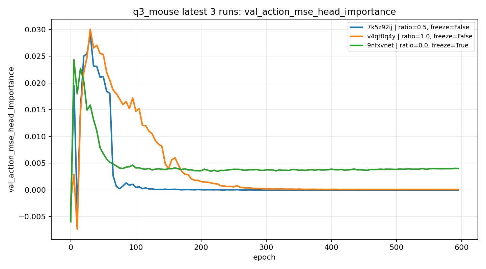
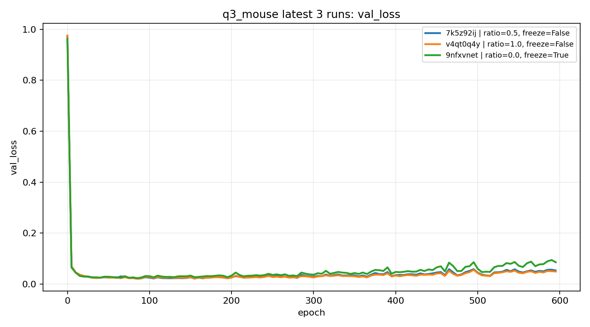
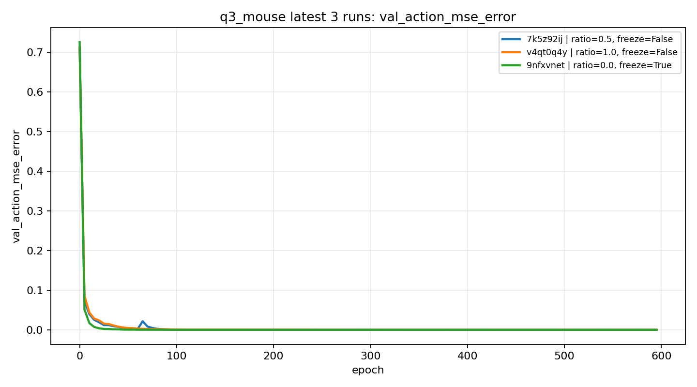

# q3_mouse 实验矩阵（中文）

最后更新：2026-03-20  
适用分支：`codex/progress-aware-sampling`  
主要工作区：`train_diffusion_unet_timm_single_frame_workspace`

## 1. 背景与目标

当前任务现象：

1. 任务后半段需要头视角信息决定左右方向。
2. 训练中容易出现 `head importance` 逐步下降（head collapse）。
3. 结构化采样（structured sampling）可延缓下降，但不一定彻底解决。
4. `freeze ViT` 可能更能保留预训练视觉能力，显著减轻 collapse。

本页目标：

1. 汇总已完成的关键 run（便于新人快速对齐背景）。
2. 给出下一轮可执行的实验矩阵（围绕三条主轴）：
   - structured sampling ratio
   - 是否冻结 ViT encoder
   - encoder 学习率（UNet 中为 `training.encoder_lr_coefficient`）

## 2. 已完成实验汇总（来自 W&B 最新三条）

项目：`apricity-shen2-shanghai-jiaotong-university/diffusion_policy_debug`

| 序号 | run id | 时间标题 | structured ratio | freeze ViT | encoder lr 系数 | `val_head_importance@85` | `val_head_importance@595` | `best val_loss` | 备注 |
|---|---|---|---:|---|---:|---:|---:|---:|---|
| R1 | `7k5z92ij` | `2026.03.18-21.06.32...` | 0.5 | 否 | 0.1 | 0.001294 | -0.000049 | 0.021057 | 延缓有限，后期接近 collapse |
| R2 | `v4qt0q4y` | `2026.03.18-22.10.27...` | 1.0 | 否 | 0.1 | 0.016519 | 0.000082 | 0.021329 | 比 0.5 明显更稳，但后期仍显著衰减 |
| R3 | `9nfxvnet` | `2026.03.19-10.49.48...` | 0.0 | 是 | N/A | 0.004262 | 0.003991 | 0.023200 | 后期仍保持较高 head importance |

初步结论（当前证据）：

1. 提高 structured ratio（0.5 -> 1.0）确实能延缓 head importance 下滑。
2. `freeze ViT` 对“后期是否 collapse”影响更大。
3. 需要继续验证：`freeze` 稳定性收益是否能在部署成功率上兑现，且不牺牲主任务表现。

### 2.1 完整曲线证据（最新三条）

`ratio 影响下降速度` 以及 `freeze 对后期稳定性` 建议以完整曲线为准，不只看单点：







## 3. 下一轮实验矩阵（建议执行）

说明：

1. 先做 UNet single-frame，固定其他超参与数据划分。
2. 每个配置建议至少 2 个 seed（推荐 42/43）。
3. 统一在关键 epoch（如 85, 120, 300, 595）记录指标。

### 3.1 阶段 A：主效应筛查（最小集）

| 试验号 | structured ratio | freeze ViT | encoder lr 系数 | 目的 | 状态 |
|---|---:|---|---:|---|---|
| A1 | 0.0 | 否 | 0.1 | 基线（不冻结，不结构化） | 待跑 |
| A2 | 0.5 | 否 | 0.1 | 对比结构化采样中等强度 | 已有近似（R1） |
| A3 | 1.0 | 否 | 0.1 | 对比结构化采样高强度 | 已有近似（R2） |
| A4 | 0.0 | 是 | N/A | 仅看冻结效果 | 已有近似（R3） |
| A5 | 0.5 | 是 | N/A | 冻结 + 中等结构化是否叠加收益 | 待跑 |
| A6 | 1.0 | 是 | N/A | 冻结 + 高结构化是否进一步提升 | 待跑 |

### 3.2 阶段 B：encoder lr 微调（仅在不冻结分支）

| 试验号 | structured ratio | freeze ViT | encoder lr 系数 | 目的 | 状态 |
|---|---:|---|---:|---|---|
| B1 | 1.0 | 否 | 0.1 | 当前默认 | 已有近似（R2） |
| B2 | 1.0 | 否 | 0.03 | 降低 encoder 更新速度，减少预训练能力漂移 | 待跑 |
| B3 | 1.0 | 否 | 0.01 | 更强保守微调 | 待跑 |
| B4 | 0.5 | 否 | 0.03 | 检查 ratio 与 lr 的交互 | 待跑 |

备注：

1. UNet 中 encoder lr 实际为：
   - `obs_encoder_lr = optimizer.lr * training.encoder_lr_coefficient`
   - 当 `pretrained=True` 且 `use_lora=False` 时生效。
2. `freeze ViT=True` 时，encoder lr 不再是有效控制项。

## 4. 关键指标与判据

建议每条 run 都记录下表：

| 指标 | 含义 | 期望方向 |
|---|---|---|
| `val_action_mse_head_importance` | head 信息贡献代理指标 | 后期不塌缩（维持正值且不过快衰减） |
| `val_action_mse_error` | 主要动作误差 | 越低越好 |
| `val_loss` | 去噪目标下的验证损失 | 重点看形态与拐点，不单看“越低越好” |
| 左右部署成功率（left/right） | 真实任务目标 | 双侧均衡、总成功率高 |

建议判据：

1. 若后期（如 epoch >= 300）`val_head_importance` 仍稳定为正，记为“抗 collapse”。
2. `val_loss` 在扩散任务里出现“前快降、后缓升”并不必然代表坏过拟合，需结合：
   - `val_action_mse_error`
   - 左右部署成功率
   - 曲线是否出现异常震荡或早期失稳
3. 若只提升 importance 但部署无收益，应谨慎解读。

## 5. 推荐命令模板（UNet）

基础命令（8 卡 AMP，结构化开关）：

```bash
make train_acc8_amp_structured \
  TASK=q3_mouse \
  WKSPACE=train_diffusion_unet_timm_single_frame_workspace \
  LOCAL_DATASET_ZARR=/mnt/workspace/users/shenyibo/umi_base/.cache/q3_mouse_dh_train/replay_buffer.zarr \
  STRUCTURED_RATIO=1.0
```

追加覆盖参数示例：

```bash
# 冻结 ViT
training.freeze_encoder=true

# 不冻结时调 encoder lr 系数
training.encoder_lr_coefficient=0.03
```

（若通过命令行直传 Hydra overrides，可附加在 `train.py` 启动命令后）

## 6. 结果填写模板（复制即用）

| 日期 | run id | ratio | freeze | encoder lr 系数 | best val_loss | val_mse@595 | val_head_imp@595 | 部署左/右成功率 | 结论 |
|---|---|---:|---|---:|---:|---:|---:|---|---|
| YYYY-MM-DD | `xxxxxx` |  |  |  |  |  |  |  |  |
